# ⏰ Digital Clock Simulation System

## 🚀 Overview

This project is a real-time digital clock visualization system built by integrating:

* MATLAB Simulink
* Digital Logic Design
* Python
* Streamlit
* HTML/CSS-based 7-Segment Rendering

The system simulates a complete digital electronics timing pipeline — from clock pulse generation to real-time visual display.

Rather than creating a simple UI clock, this project focuses on the engineering architecture behind how digital clocks actually work.

---

# 🔥 Project Highlights

✅ 50 Hz hardware-like clock pulse simulation
✅ Cascaded MOD counter architecture
✅ Digital timing logic implementation
✅ Simulink → Python integration using `.mat` files
✅ Real-time 7-segment display emulation
✅ Streamlit-based interactive UI
✅ Custom HTML/CSS rendering engine
✅ Modular Python code architecture

---

# ⚙️ System Architecture

## 1. Signal Generation Layer (Simulink)

The core timing signal is generated using a:

```text
50 Hz Clock Signal
```

This signal is processed using cascaded modular counters to generate:

* Seconds
* Minutes
* Hours

### Counter Logic Used

| Counter      | Purpose              |
| ------------ | -------------------- |
| MOD-10       | Ones digit counting  |
| MOD-6        | Tens digit counting  |
| MOD-60 Logic | Full timing rollover |

The counters are connected using:

* Trigger cascading
* Enable propagation
* Reset logic
* Discrete timing synchronization

This creates a hardware-like digital timing system.

---

# 🔢 Digital Encoding Layer

The Simulink model outputs:

* Binary-coded timing signals
* 7-segment activation vectors
* Digit-wise display data

Each digit is encoded into:

```text
[a, b, c, d, e, f, g]
```

segment activation arrays.

The data is exported into MATLAB `.mat` files and loaded into Python.

---

# 🧠 Python Processing Layer

Python acts as the interface layer between:

```text
Digital Logic Simulation → Visual Rendering
```

The Python engine:

* Loads simulation data
* Decodes segment vectors
* Synchronizes timing frames
* Builds display-ready signals
* Generates real-time visual output

The code architecture is modularized into reusable functions such as:

```python
get_7_segment_values()
draw_digit()
display_clock()
```

---

# 🎨 Visualization Engine

The final display system is built using:

* Streamlit
* HTML
* Inline CSS

Each digit is rendered as a custom virtual 7-segment LED display.

## Segment Logic

| Signal | State                 |
| ------ | --------------------- |
| 1      | Glowing red segment   |
| 0      | Inactive dark segment |

The rendering engine dynamically updates all digits frame-by-frame to simulate real-time clock behavior.

---

# 📸 Features

## 🏠 Home Page

* Real-time clock animation
* Start/Stop control
* Responsive digital display

## 📘 About App Section

Explains:

* Simulink architecture
* Digital logic design
* Signal processing workflow
* Python rendering pipeline

## 🔥 Summary Section

Provides a concise overview of the full engineering workflow.

---

# 🛠️ Technologies Used

| Technology      | Purpose                  |
| --------------- | ------------------------ |
| MATLAB Simulink | Digital logic simulation |
| MATLAB          | Data export              |
| Python          | Data processing          |
| Streamlit       | Web application          |
| HTML/CSS        | 7-segment rendering      |
| NumPy           | Array processing         |
| SciPy           | `.mat` file loading      |

---

# 📂 Project Structure

```text
Digital_Clock/
│
├── python_code.py
├── clock_data.mat
├── simulink_model.slx
├── README.md
└── assets/
```

---

# ▶️ Running the Project

## 1. Install Dependencies

```bash
pip install streamlit scipy numpy
```

## 2. Run the Streamlit App

```bash
streamlit run python_code.py
```

---

# 🧩 Core Engineering Concepts Demonstrated

This project demonstrates:

* Digital electronics logic
* Cascaded modular counters
* Hardware-style timing systems
* Signal processing pipelines
* Software-hardware integration
* Real-time rendering systems
* Embedded-system-like architecture

---

# 🚀 Future Improvements

Potential future upgrades:

* Real-time system clock synchronization
* Alarm system
* Stopwatch mode
* Oscilloscope visualization
* FPGA implementation
* Arduino integration
* Dark/light themes
* Sound effects

---

# 🧠 Key Learning Outcome

This project transformed a simple digital clock into a complete multi-domain engineering system by combining:

```text
Signal Processing
→ Digital Logic Design
→ Software Decoding
→ Real-Time Visualization
```

It serves as a bridge between theoretical electronics and modern software engineering.

---

# 👨‍💻 Author

## Samrat Malla

Electrical Engineering Student
Software-Driven Systems Builder
Passionate about Embedded Systems, Simulation, AI, and Future Technologies.

---

# ⭐ Final Note

This project represents more than a clock.

It represents the process of learning how complex systems are built — one layer at a time.


# 📸 Project Visuals

## 🏠 System Output (7-Segment Clock UI)

<p align="center">
  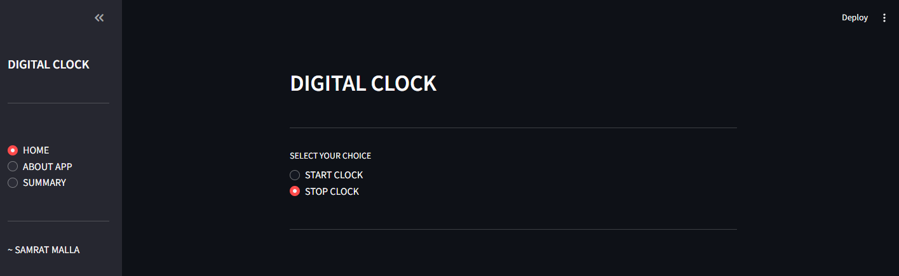
  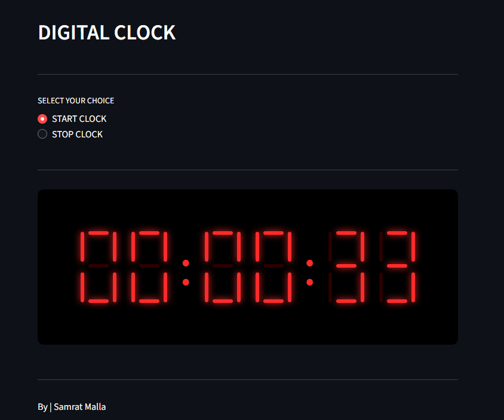
  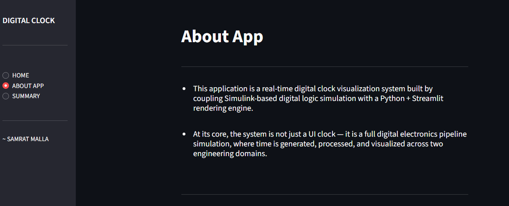
</p>

---

## ⚙️ Simulink Model Architecture

<p align="center">
  
  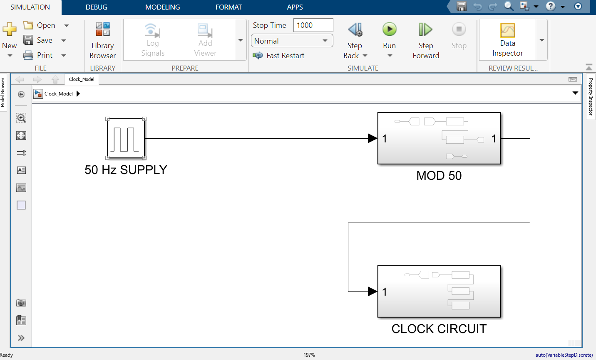
  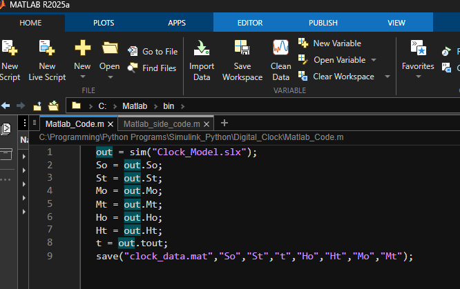
</p>

---

## 🔢 Digital Logic / Counter Design

<p align="center">
  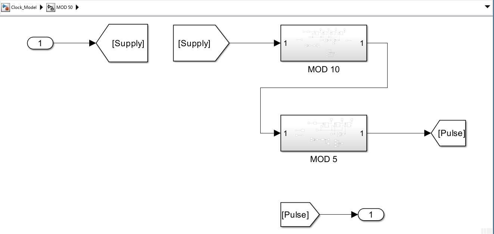
  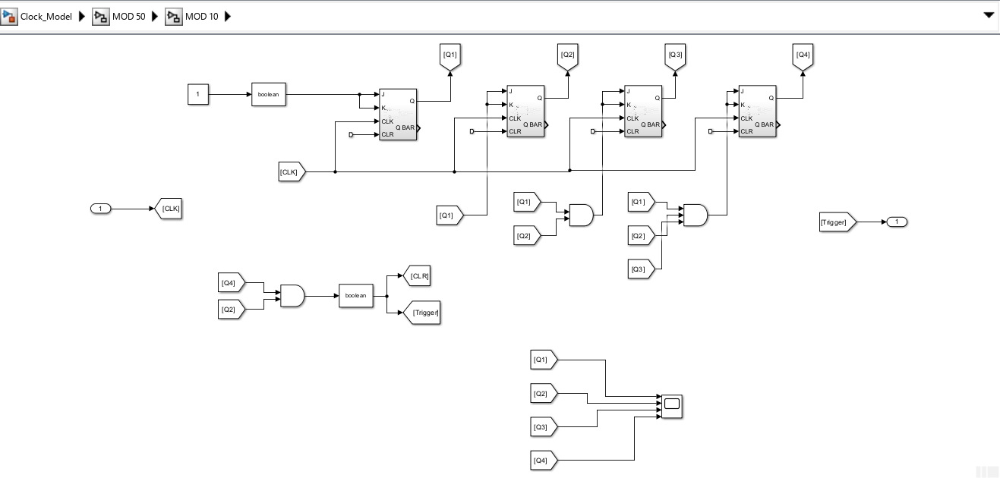
  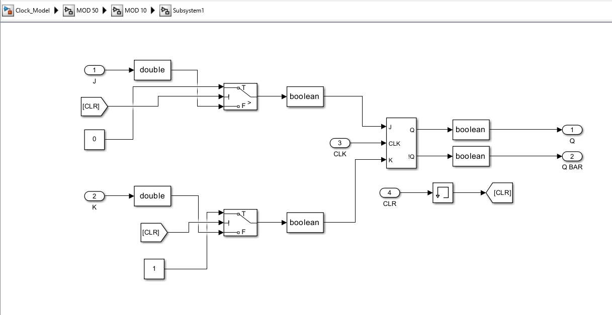
  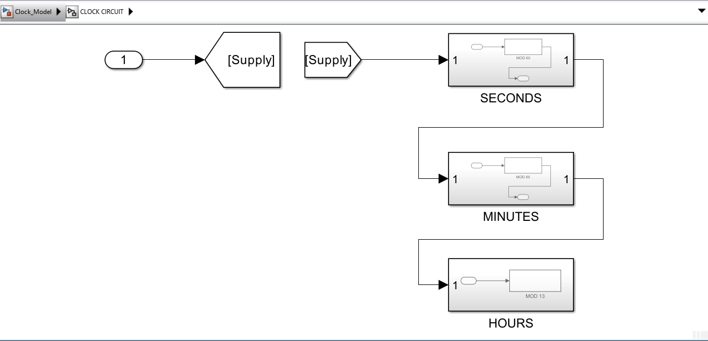
  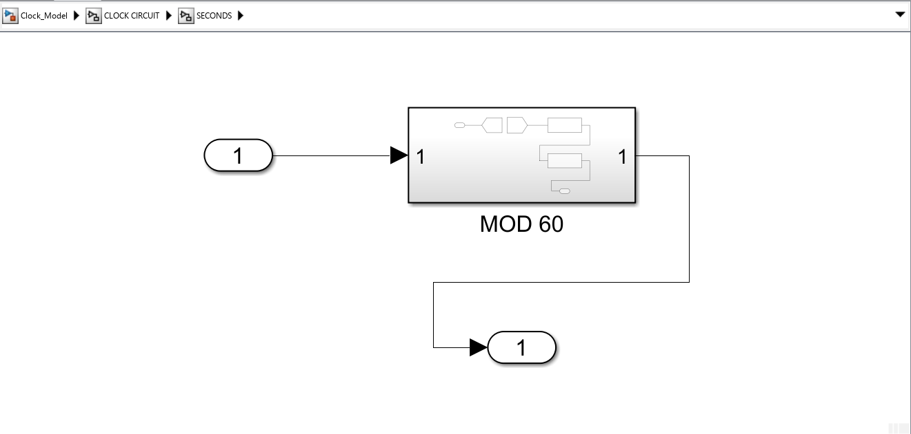
  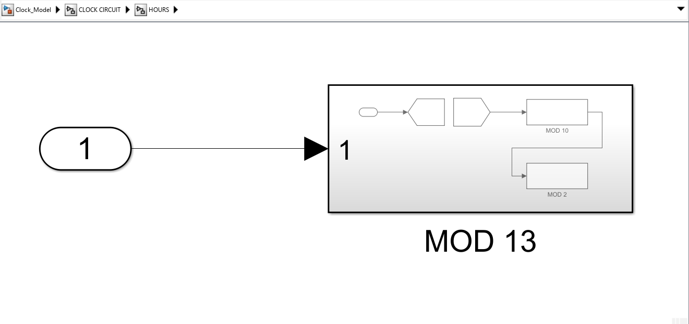
</p>

---


## 🎨 Final Streamlit Rendering Engine

<p align="center">

  
  
</p>
